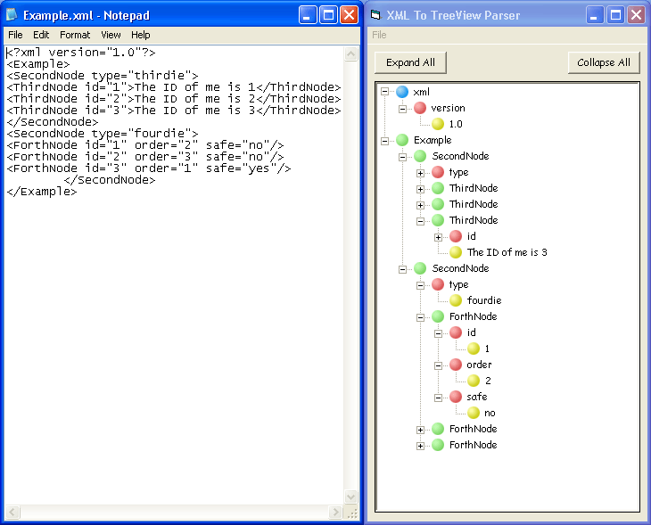



## XML To TreeView Parser

### Description

Will put parsed XML into a TreeView control.
 
### More Info
 

             |
---                |---
**Submitted On**   |2002-06-12 14:11:24
**By**             |[Phoenix](https://github.com/Planet-Source-Code/PSCIndex/blob/master/ByAuthor/phoenix.md)
**Level**          |Intermediate
**User Rating**    |4.7 (52 globes from 11 users)
**Compatibility**  |VB 6\.0
**Category**       |[Files/ File Controls/ Input/ Output](https://github.com/Planet-Source-Code/PSCIndex/blob/master/ByCategory/files-file-controls-input-output__1-3.md)
**World**          |[Visual Basic](https://github.com/Planet-Source-Code/PSCIndex/blob/master/ByWorld/visual-basic.md)
**Archive File**   |[XML\_To\_Tre934066122002\.zip](https://github.com/Planet-Source-Code/phoenix-xml-to-treeview-parser__1-35751/archive/master.zip)

